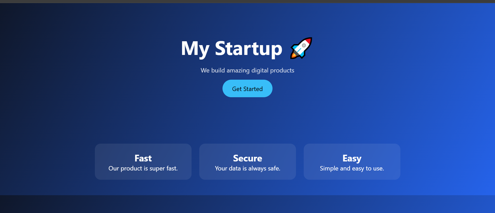

https://github.com/yashpatil7313/site-2-landing-page/settings/pages

# 🚀 Startup Landing Page - Day 1 Project 2

## 📌 Project Overview
This project is a modern **Landing Page Website** created as part of my semester task to build 200 websites.

It represents a startup/product homepage with a clean and attractive UI.

---

## 🎯 Features
- Modern Hero Section
- Call-to-Action Button
- Feature Cards (Fast, Secure, Easy)
- Responsive Layout
- Smooth Hover Effects

---

## 🛠️ Technologies Used
- HTML5
- CSS3

---

## 📂 Project Structure

site-2-landing-page/
│
├── index.html
├── style.css
└── README.md

---

## 📸 Preview

---

## 🌍 Live Demo
https://github.com/yashpatil7313/site-2-landing-page/settings/pages

---

## 💡 Learning Outcome
- Learned how to design a landing page
- Used Flexbox for layout
- Applied modern UI styling
- Improved Git & GitHub workflow

---

## 🔥 Author
**Yash Patil**  
Future Data Engineer 🚀

---

## ⭐ Note
This project is part of my challenge to build **200 websites** for practice a
